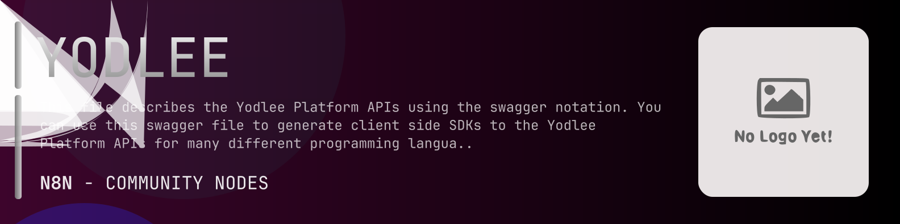

# @n8n-dev/n8n-nodes-yodlee



[](https://www.npmjs.com/package/@n8n-dev/n8n-nodes-yodlee)
[](https://opensource.org/licenses/MIT)

---

**Stop writing yodlee API integrations by hand.**

Every time you connect n8n to yodlee, you waste hours mapping endpoints, defining parameters, and debugging schemas. You copy-paste from docs, fix edge cases, and pray nothing breaks.

**What if connecting n8n to yodlee took 5 minutes, not half a day?**

This node gives you **15+ resources** out of the box: **Accounts**, **Auth**, **Cobrand**, **Configs**, **Data Extracts**, and 10 more: with full CRUD operations, typed parameters, and zero manual configuration.

---

## What You Get

- **Zero boilerplate**: Resources, operations, and fields are pre-configured and ready to use
- **Full CRUD**: Create, read, update, and delete support where the API allows it
- **Typed parameters**: No more guessing field types
- **Built-in auth**: API key authentication, ready to go
- **Declarative**: Native n8n performance, no custom execute() overhead

---

## Install

```bash
npm install @n8n-dev/n8n-nodes-yodlee
```

**Or in n8n:**
1. **Settings → Community Nodes → Install**
2. Search: `@n8n-dev/n8n-nodes-yodlee`
3. Click **Install**

---

## Quick Start

1. Install the node (above)
2. Add credentials: **yodlee API** → paste your API key
3. Drag the **yodlee** node into your workflow
4. Pick a resource → pick an operation → done.

That's it. No configuration files. No code. It just works.

---

## Resources

| Resource | Operations |
|----------|------------|
| Accounts | GET Get Accounts, POST Add Manual Account, POST Evaluate Address, GET Get Historical Balances, DELETE Delete Account, GET Get Account Details, PUT Update Account |
| Auth | GET Get API Keys, POST Generate API Key, DELETE Delete API Key, DELETE Delete Token, POST Generate Access Token |
| Cobrand | POST Cobrand Login, POST Cobrand Logout |
| Configs | GET Get Subscribed Notification Events, DELETE Delete Notification Subscription, POST Subscribe For Notification Event, PUT Update Notification Subscription, GET Get Public Key |
| Data Extracts | GET Get Events, GET Get userData |
| Derived | GET Get Holding Summary, GET Get Networth Summary, GET Get Transaction Summary |
| Documents | GET Get Documents, DELETE Delete Document, GET Download a Document |
| Holdings | GET Get Holdings, GET Get Asset Classification List, GET Get Holding Type List, GET Get Security Details |
| Provider Accounts | GET Get Provider Accounts, PUT Update Account, GET Get User Profile Details, DELETE Delete Provider Account, GET Get Provider Account Details, PUT Update Preferences |
| Providers | GET Get Providers, GET Get Providers Count, GET Get Provider Details |
| Statements | GET Get Statements |
| Transactions | GET Get Transactions, GET Get Transaction Category List, POST Create Category, PUT Update Category, POST Create or Run Transaction Categorization Rule, DELETE Delete Transaction Categorization Rule, POST Run Transaction Categorization Rule, PUT Update Transaction Categorization Rule, GET Get Transaction Categorization Rules, DELETE Delete Category, GET Get Transactions Count, PUT Update Transaction |
| User | GET Get User Details, PUT Update User Details, GET Get Access Tokens, POST User Logout, POST Register User, POST Saml Login, DELETE Delete User |
| Verification | GET Get Verification Status, POST Initiaite Matching Service and Challenge Deposit, PUT Verify Challenge Deposit |
| Verify Account | POST Verify Accounts Using Transactions |

---

## Why This Node?

**Without this node:**
- Hours of manual API integration
- Copy-pasting from yodlee docs
- Debugging auth, pagination, error handling
- Maintaining your own client code

**With this node:**
- Install → configure → use. 5 minutes.
- Auto-generated from the official yodlee OpenAPI spec
- Always up to date when the API changes
- Native n8n performance

---

## Auto-Generated
This node was auto-generated from the official **yodlee** OpenAPI specification using
[@n8n-dev/n8n-openapi-node-ultimate](https://github.com/kelvinzer0/n8n-openapi-node-ultimate),
then validated against the live API so you get accurate types and real parameters, not guesswork.

When the yodlee API updates, this node updates too.

---

## Support This Project

If this node saved you hours of work, consider supporting continued development, new APIs, better error handling, and faster updates.

[](https://n8n-code.github.io/membership/#/eyJ0aXRsZSI6IktlZXAgSXQgTW92aW5nIiwiZGVzYyI6Ik9uZSBkZXZlbG9wZXIgYnVpbHQgYSB0b29sIHRoYXQgYXV0by1nZW5lcmF0ZXNcbm44biBub2RlcyBmcm9tIGFueSBPcGVuQVBJIHNwZWMuXG5cbllvdXIgZG9uYXRpb24gZnVuZHMgbmV3IGZlYXR1cmVzLCBtb3JlIEFQSSBzdXBwb3J0LFxuYW5kIGJldHRlciB0b29saW5nIGZvciBldmVyeSBkZXZlbG9wZXIgYWZ0ZXIgeW91LiIsInRhcmdldCI6NTAwMCwiYWRkcmVzc2VzIjp7ImV0aGVyZXVtIjoiMHhmMDU1NWQ0MGRiRkI0ZTNCZjA3MDQ0MjgyQjc4RjJmRTFmNTFFZjcyIiwic29sYW5hIjoiNlpEVk5BYmpZZExEcXo4cGt3VUNHYllaNVV3QlFranB0QzU1Wk5vTFcybVUifSwiZGlzY29yZCI6Imh0dHBzOi8vZGlzY29yZC5nZy9wdERaOGU0aDkzIn0)

---

## License

MIT © [kelvinzer0](https://github.com/n8n-code)
